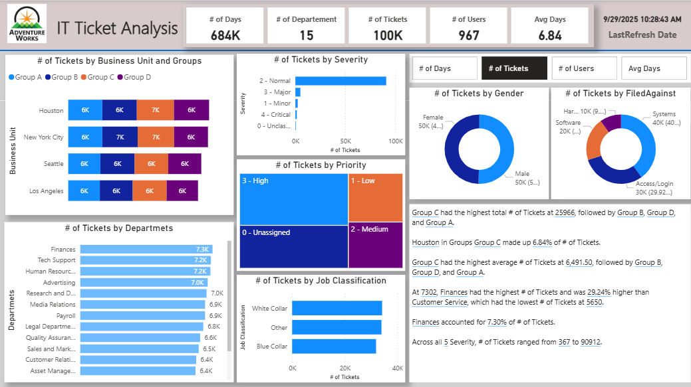

# IT-Ticket-Analysis-Dashboard

This Power BI dashboard provides a comprehensive analysis of IT support tickets within an organization. It visualizes key metrics such as ticket counts, severity, priority, business units, departments, job classifications, and user demographics.

---

## Project Objectives
The main objectives of this project are to:  
- Analyze IT ticket trends to improve support efficiency.  
- Identify departments or business units with high ticket volumes.  
- Highlight ticket severity and priority for better resource allocation.  
- Provide insights into user demographics and job classifications for targeted support.  
- Enable quick decision-making through interactive dashboards and visualizations.

---

## Features
- **High-level KPIs**: # of Days, Tickets, Users, Avg Days.  
- **Tickets by Business Unit & Groups**: Stacked bar chart showing ticket distribution across groups and cities.  
- **Tickets by Severity & Priority**: Horizontal bar charts showing ticket severity levels and priority.  
- **Tickets by Departments**: Horizontal bar chart highlighting tickets per department.  
- **Tickets by Job Classification**: Compare tickets by White Collar, Blue Collar, and Other job types.  
- **Tickets by Gender & Filed Against**: Donut charts showing distribution by gender and issue category.  
- **Insights Section**: Key findings summarized for quick understanding.
- **Interactive Tooltips**: Show additional information when hovering over charts.  
- **Drill-through / Detailed Pages**: Users can explore tickets by department, severity, or priority in depth by opening the detailed page in Power BI Desktop.

---

## Dashboard Insights
- **High Ticket Volume Departments**: Departments with the most tickets may need extra support or process improvements.  
- **Severity & Priority Trends**: Most tickets are low/medium severity; high-priority tickets need quick resolution.  
- **Business Unit Patterns**: Certain units report more IT issues, reflecting system usage or complexity.  
- **Job Classification Differences**: White Collar employees submit more tickets, indicating possible training or usage gaps.  
- **Gender & Issue Distribution**: Highlights user groups that may require targeted support.  
- **Average Resolution Time**: `Avg Days` KPI shows how long tickets remain open, measuring IT service efficiency.

---

## Learning Context

This dashboard was created while following a Power BI course on Udemy. The tutorial guided the base dashboard creation, and additional visuals and custom charts were added to enhance analysis.

---

## Screenshot

---

## How to Use

1. Open the Power BI Desktop file (`.pbix`) in Power BI Desktop.  
2. Interact with slicers, filters, and visuals to explore ticket data.  
3. Analyze trends by department, severity, priority, business unit, and user classification.

---

## License

This project is for learning purposes and personal portfolio use.

